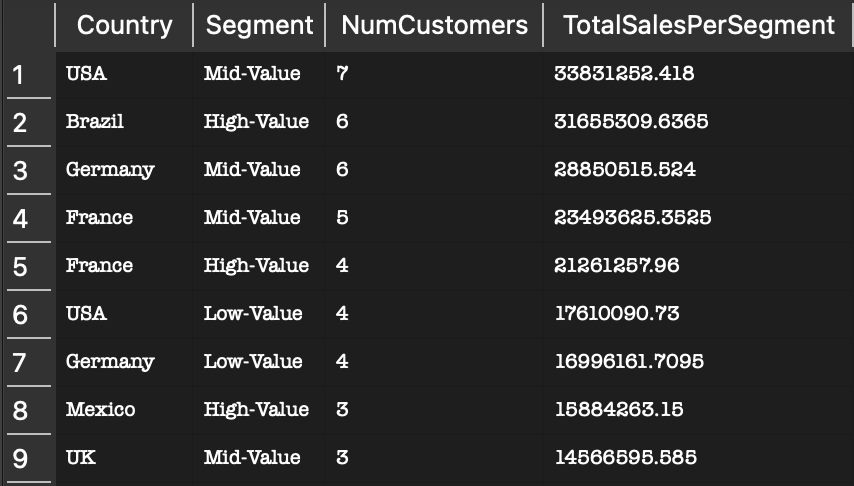

# SQL Retail Analytics – Product, Customer, and Inventory Insights

**Author**: Houcine E  
**Project Type**: Data Analysis with SQL  
**Presentation**: [Watch the Video](#) *(Link will go here)*

---

## Project Overview

In this project, I used SQL to analyze retail data from the Northwind database. I focused on three key areas: identifying top-performing product categories, ranking customers by total sales and assigning value tiers, and generating restock recommendations based on demand and stock levels. I used CTEs, window functions, and conditional logic to extract insights that support better business decisions.

---

---

## Key Insights

---

### Product Category Performance – Revenue Leaders

I used a CTE to calculate total sales per category by multiplying unit price, quantity, and discount for each order line. I also counted the number of distinct products per category to get average revenue per product. Beverages led with over 92 million in sales, while Meat/Poultry had the highest average revenue per product despite a smaller catalog. These insights help identify which categories are the most profitable and scalable.

---

### Customer Segmentation – High-Value Buyers by Country

I summed total sales per customer and applied the `PERCENT_RANK()` window function to rank customers into High-, Mid-, or Low-Value segments. Then I grouped and aggregated customer counts and revenue by country and segment. The results showed that countries like the UK, USA, and Brazil had the largest share of high-value customers, making them strong targets for loyalty programs or region-specific campaigns.

---

### Inventory Restock Strategy – Demand vs Stock

I calculated average monthly sales per product using `AVG(Quantity)` and compared it to current stock levels, units on order, and each product’s reorder threshold. Products were classified with a `CASE` statement into categories like “Restock Now,” “Restock More,” “Overstocked,” or “Maintain Stock.” The logic highlighted understocked items where demand exceeded availability, and overstocked items sitting well above sales needs. These insights help optimize purchasing decisions and reduce inventory waste.

---

## Business Recommendations

- **Focus on High-Performing Categories**  
  Beverages, Meat/Poultry, and Confections generated the most revenue. These categories should be prioritized in promotions and stock planning.

- **Target High-Value Markets**  
  High-value customers are concentrated in specific countries. Creating retention programs or localized campaigns in those regions could drive revenue growth.

- **Optimize Restocking Based on Demand**  
  Several products are either overstocked or undersupplied. Inventory decisions should be informed by recent sales behavior to reduce excess and avoid shortages.

---

## Tools and Techniques Used

- **Query Logic**: CTEs (`WITH`), `JOIN`s, `CASE WHEN`, aggregate functions (`SUM`, `COUNT`, `AVG`)  
- **Window Function**: `PERCENT_RANK()`  
- **Database**: Northwind (SQLite)  
- **Focus**: Business-driven queries for category performance, customer segmentation, and inventory management

